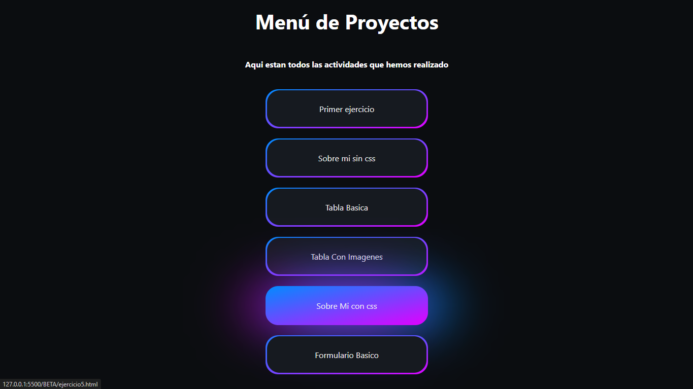
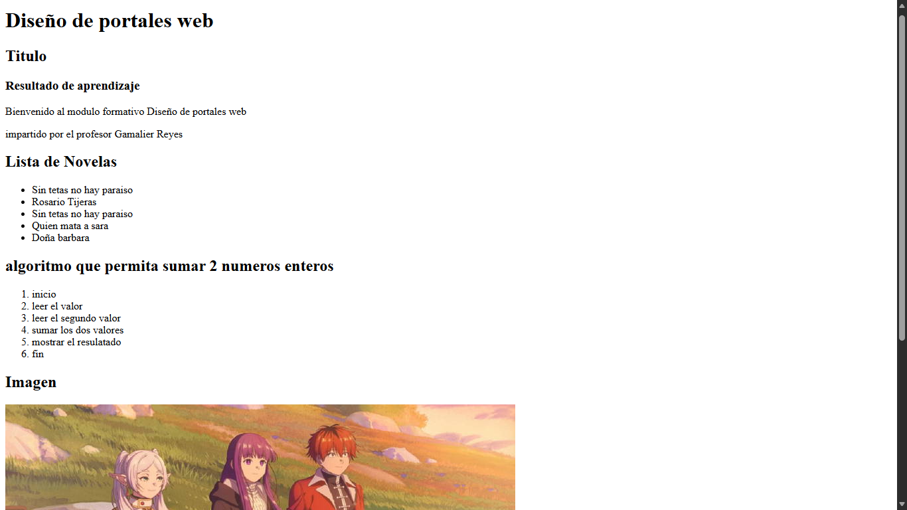

# RA3 🌐

## 👤 Sobre Mí & Menú de Proyectos

## 📌 Descripción
Este proyecto corresponde al resultado del **RA4**, donde se desarrolló un sitio web personal utilizando **HTML y CSS**.  
El sitio incluye una sección **Sobre Mí**, donde se presenta información personal básica, y un **Menú de Proyectos** que permite acceder a distintas actividades realizadas durante el módulo de Desarrollo Web.Tambien estan las imagenes de la tarea 1 de RA3

El diseño fue trabajado con estilos CSS para lograr una apariencia moderna, organizada y visualmente atractiva.

---

## 🛠️ Tecnologías Utilizadas
- **Lenguajes:** HTML, CSS  
- **Entorno de desarrollo (IDE):** Visual Studio Code  
- **Navegador de prueba:** Google Chrome  

---

## 🧩 Actividades Incluidas
Dentro del menú de proyectos se pueden acceder a las siguientes actividades:

- Primer ejercicio  
- Sobre mí sin CSS  
- Tabla básica  
- Tabla con imágenes  
- Sobre mí con CSS  
- Formulario básico  

---

## 🖼️ Imágenes de la ejecución del proyecto
A continuación se muestran algunas capturas del funcionamiento del sitio:

### Sección Sobre Mí con CSS

### Menú de Proyectos

### Ejercicio 1

### Ejercicio 2

### Ejercicio 3

### Ejercicio 4

### Ejercicio 5

### Ejercicio 6

---

## ▶️ Uso o Ejecución
Para visualizar el proyecto:
1. Descargar o clonar el repositorio.
2. Abrir el archivo  el archivo principal del menú en cualquier navegador web moderno  
   (Google Chrome, Microsoft Edge, etc.).

---

## 🎓 Contexto Académico
- **Nivel:** Secundaria Técnico Profesional  
- **Módulo Formativo:** Desarrollo Web  
- **Resultado de Aprendizaje:** RA3 
- **Curso / Sección:** 4to D  
- **Año escolar:** 2025 - 2026  
