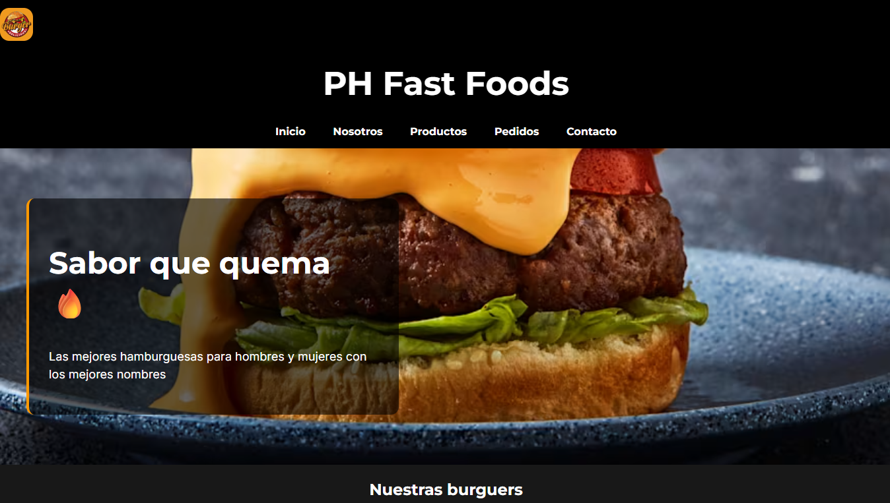
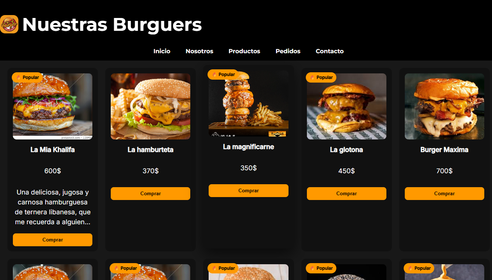
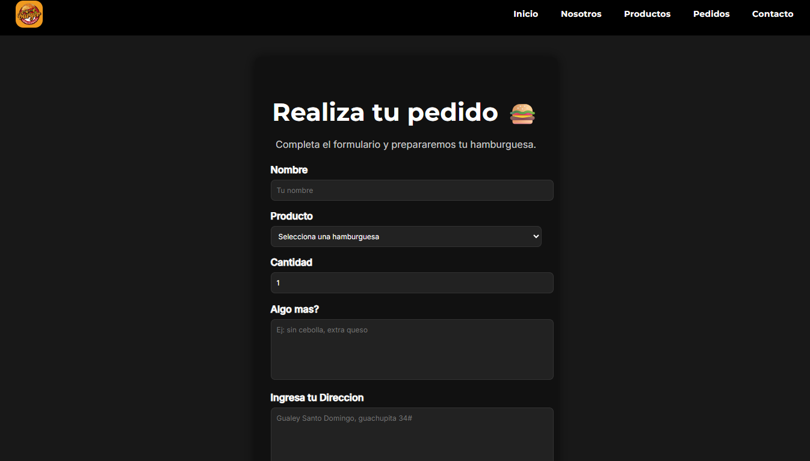

# RA4

## 🍔 PH Fast Food

## 📌 Descripción
PH Fast Food es un sitio web de hamburguesas donde se muestran distintos productos con sus imágenes, precios y descripciones, diseñado de forma sencilla y atractiva para el usuario.
El formulario es una actividad basica con HTML  y CSS 

## 🛠️ Tecnologías Utilizadas
- **Lenguajes:** HTML, CSS  
- **Herramientas de diseño:** Figma  
- **Entorno de desarrollo (IDE):** Visual Studio Code  

## 🖼️ Imágenes de la ejecución de los proyectos
Aquí se pueden observar distintas secciones del sitio como:

### Página de inicio

### Página de productos

### Página de pedidos

## Formulario con CSS

## ▶️ Uso o Ejecución
Para visualizar el proyecto, solo es necesario abrir el archivo tendria que pasarte el link principal en cualquier navegador web moderno (Google Chrome, Microsoft Edge, etc.)

## 🎓 Contexto Académico
- **Nivel:** Secundaria Técnico Profesional
- **Módulo Formativo:** Desarrollo Web
- **Curso / Sección:** 4to D
- **Año escolar:** 2025-2026

